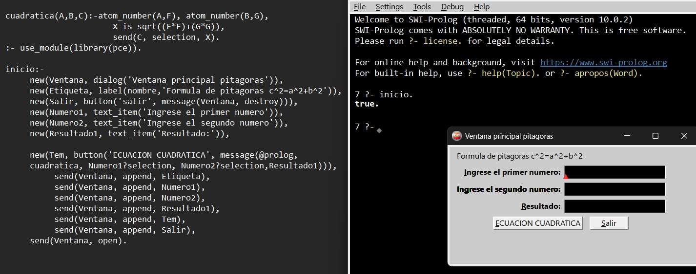
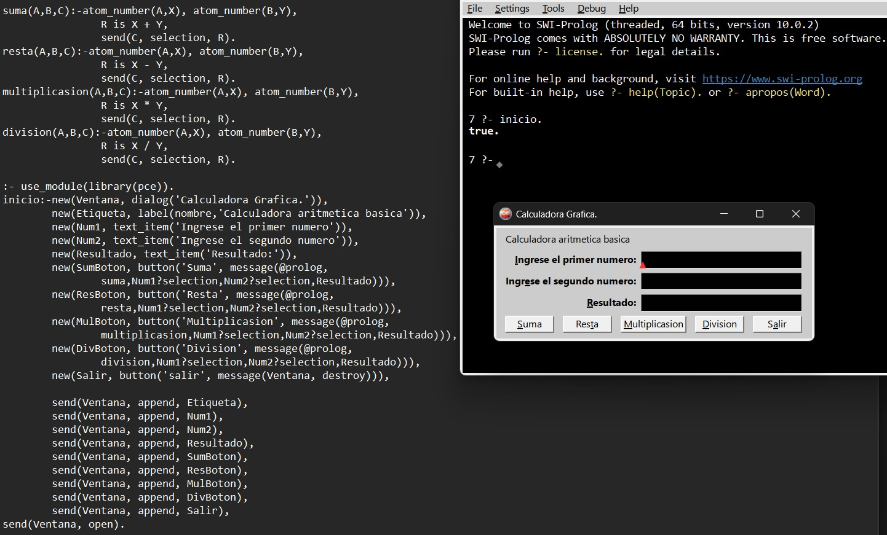

# Programcion logica y funcional 

En este archivo se recopila todo lo que se avanzo en la materia de Prolog, materia (INF-318) UAGRM.

## contenido del semestre 

    -Operadores.
    -uso de familias y reglas. 
    -Ciclos usando recurcion.
    -Listas.
    -librerias para trabajar de menera sgrafica.

### ejecutando 08_pitagoras

### ejecutando 10_calculadoraBasica_grafica

